# Setup Keycloak

keycloakでOpenID Provider(OP)を用意する。

keycloakをOpenID Providerとして利用するための設定を順に記載する。

## Realm

アプリケーションのユーザー・ロール・スコープ等を管理するRealmを作成する。

- `Add realm`ボタンを押す
- `Name`に`sample-oidc`を入力する
- `Create`ボタンで作成する

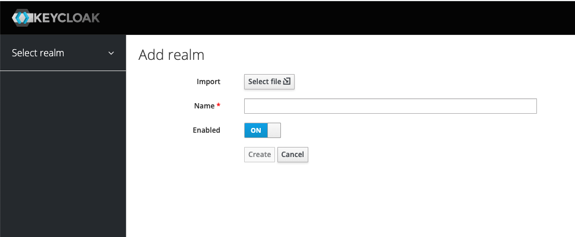

## Realm Role

アプリケーションで共通のロールを作成する。

例として、下記のロールを作成する。

- admin
- developer
- support

`Add Role`ボタンから追加出来る。

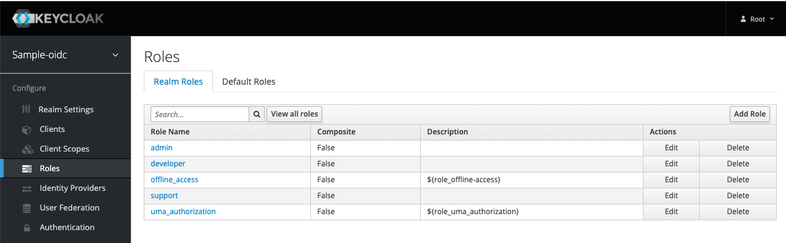

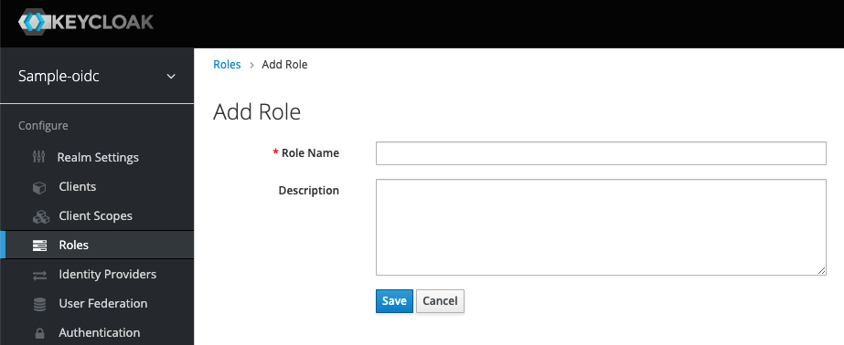

## Client Scopes

アプリケーションで共通のスコープを作成する。

下記は、アプリケーションのユーザーを識別するIDになる。

- user_id

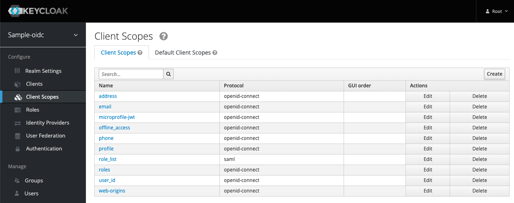

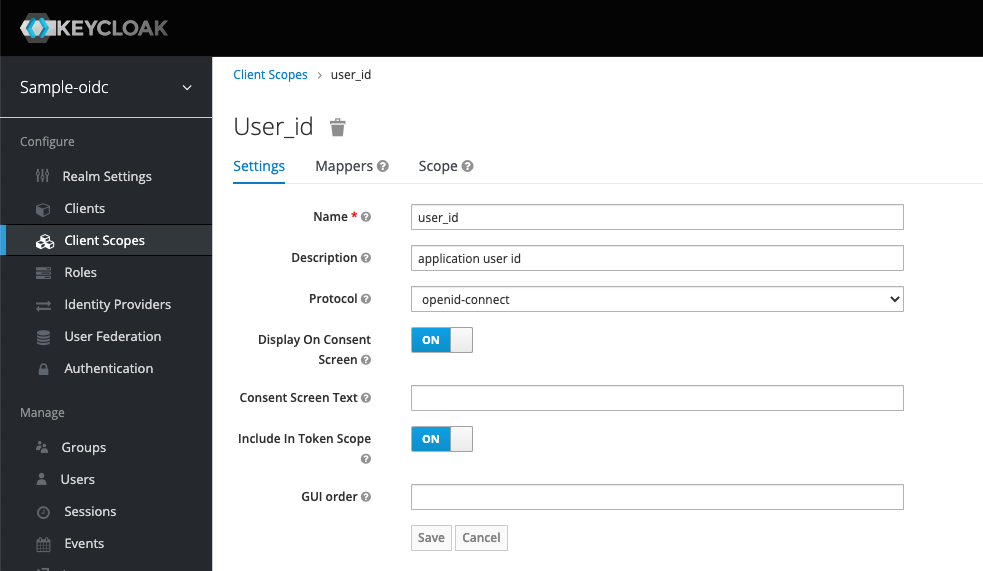

作成したscopeをアクセストークンのクレームに追加するため、mapperを作成する。

- `user_id`のClient Scopeを選択する
- `Mappers`タブを選択する
- `Create`ボタンで登録する
- `Mapper Type`は`User Attribute`を選択する
  - `User Attribute`で指定できる項目は、ユーザーの`Attributes`で設定した値になる
  - `User Attribute`に設定する値は、ユーザーの`Attributes`の`Key`を指定する
- `Save`ボタンで保存する

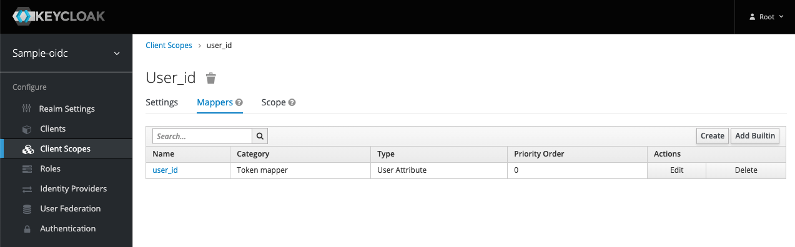

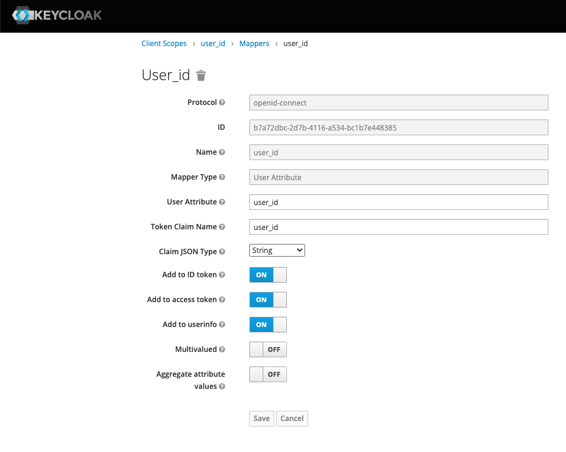

RealmでClientを作成するときに、デフォルトで`Client Scope`が適用されるように設定する。

- `Default Client Scopes`タブを選択する
- `user_id`を`Add selected`で`Assigned Optional Client Scopes`に移動する
  - Clientを作成したときに、Clientの`Client Scopes`の設定に反映されるようになる

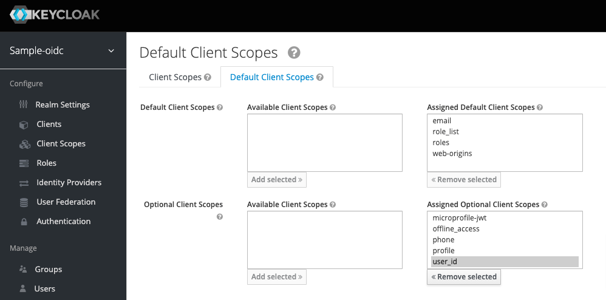

> realmの`Client Scopes`の`Default Client Scopes`を設定する前に、作成されたClientには設定が適用されない。
>
> `Default Client Scopes`を適用するには、Clientの詳細から`Client Scopes`を開いて設定を更新する。

## Client

Client(アプリケーションのクライアント)を作成する。

- `Client ID`に`sample-app`を入力する
- `Client Protocol`で`openid-connect`を選択する
- `Root URL`でアプリケーションのURLを入力する
  - リソースサーバのURLを入力する
  - 今回の例では、`mod_auth_openidc`のURLを指定する
    - `http://oidc-proxy.localtest.me:10080/`
- `Save`ボタンを押して保存する

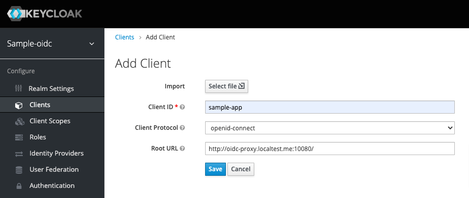

### Client Settings

Clientのアクセス方式を変更する。

- `Settings`タブを選択
- `Access Type`を`confidential`にする
- `Authorization Enabled`を`ON`にする
- `Save`ボタンを押して保存する

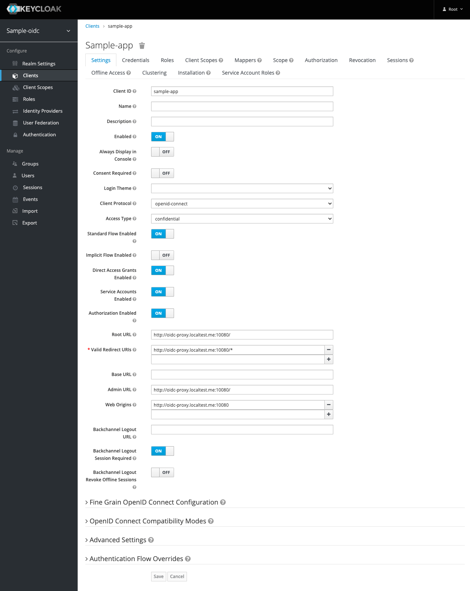

### Client Scopes

アクセストークンで指定可能なクレームを確認する。

- `Client Scopes`タブを選択
- `user_id`が`Assigned Optional Client Scopes`に存在していることを確認する
  - `Default Client Scopes`で設定した内容が反映されている

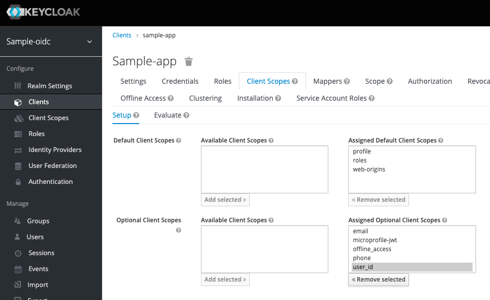

Clientの`Client Scopes`の設定について。

- `Assigned Default Client Scopes`:
  - トークンエンドポイントで`scope`パラメータにscopeの値を指定しなくてもクレームに追加される(scopeの値は,自動的にクレームに追加される)
- `Assigned Optional Client Scopes`:
  - トークンエンドポイントで`scope`パラメータにscopeの値を指定するとクレームに追加される(scopeの値は、指定された場合にクレームに追加される)

`Evaluate`タブで、現状の設定で適用されるMapperや生成されるトークンを確認出来る。

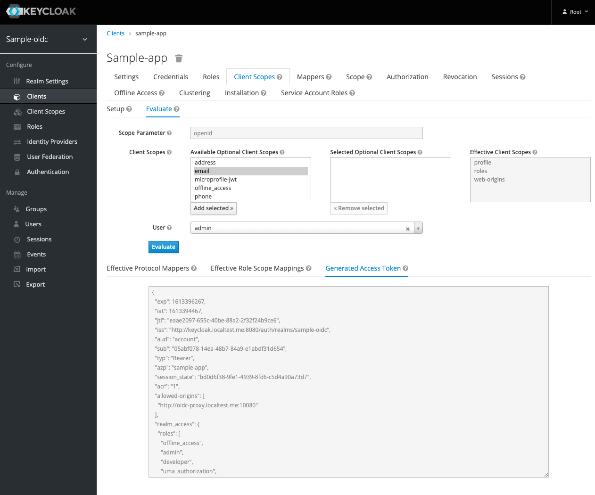

### Authorization

Clientを作成し、`Authorization Enabled`をONにすると`Authorization`タブが表示される。

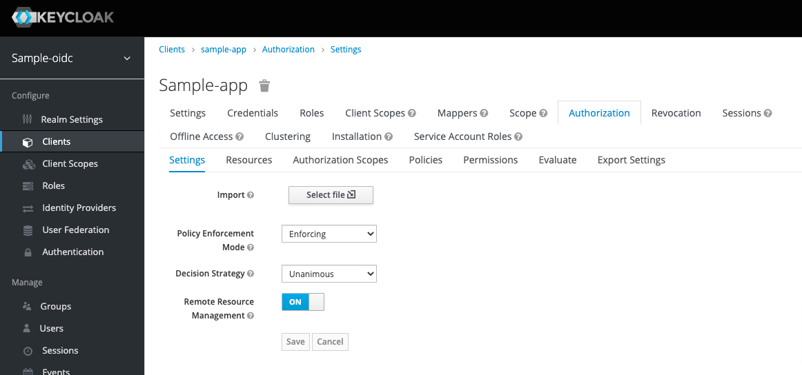

`Resource`・`Policies`・`Permissions`は、今回の構成では利用しないためデフォルトの設定で利用する。

Keycloakのクライアントアダプターを利用する場合は、
`Resource`・`Policies`・`Permissions`の設定を参照するので、
Keycloakサーバで認可の設定を管理することが出来る。

> NOTE: UMA, ポリシーエンフォーサー
> - https://keycloak-documentation.openstandia.jp/master/ja_JP/authorization_services/
> - https://www.atmarkit.co.jp/ait/articles/1904/03/news003.html
> - https://www.atmarkit.co.jp/ait/articles/1810/22/news011.html

### mod_auth_openidcの設定

#### openidc.conf

Apache(Apache HTTP Server)の設定ファイルをincludeされるディレクトリに作成する。

今回の例では、`keycloak/mod_auth_openidc/openidc.conf`に作成して、
`docker-compose`のvolumeでincludeされるディレクトリにmountしている。

設定については下記を参照。

- https://github.com/zmartzone/mod_auth_openidc/wiki/Authorization
- https://github.com/zmartzone/mod_auth_openidc/blob/master/auth_openidc.conf
